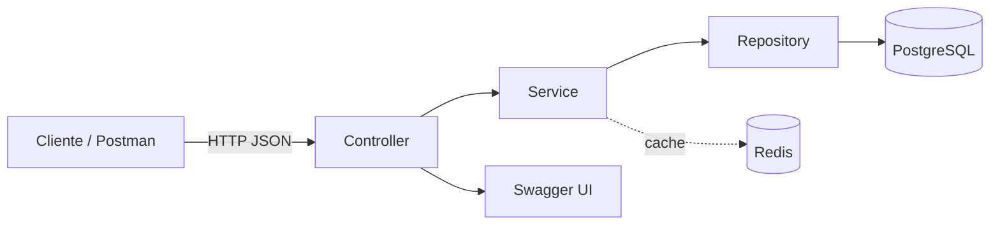

# E-commerce API

API REST completa de e-commerce com controle transacional de estoque, máquina de estados para pedidos, relatórios agregados e cache distribuído com Redis — construída para ser tão correta em concorrência quanto em regra de negócio.


## Sobre o projeto

Essa API resolve os quatro problemas clássicos de um sistema de e-commerce que costumam quebrar em produção quando implementados sem cuidado:

- **Concorrência no estoque** — duas vendas simultâneas do mesmo produto nunca deixam o estoque inconsistente, graças a Optimistic Locking (`@Version`) tratado corretamente na camada de erro.
- **Consistência transacional** — se um pedido com 5 itens falha no 3º item, o estoque dos 2 primeiros é revertido automaticamente (`@Transactional`), nunca fica "meio decrementado".
- **Regras de negócio como dado, não como código espalhado** — a máquina de estados de pedidos (`PENDING → CONFIRMED → SHIPPED → DELIVERED`, ou `CANCELLED` a qualquer momento permitido) vive em um único `Map`, não em dezenas de `if/else`.
- **Relatórios rápidos sem sobrecarregar o banco** — consultas agregadas (produtos mais vendidos, receita por período) são cacheadas no Redis com TTL de 10 minutos.

## Arquitetura



| Camada | Responsabilidade |
|---|---|
| **Controller** | recebe HTTP, valida entrada (`@Valid`), nunca contém regra de negócio |
| **Service** | regra de negócio, transações (`@Transactional`), cache (`@Cacheable`) |
| **Repository** | acesso a dados via Spring Data JPA e JPQL |
| **GlobalExceptionHandler** | traduz exceções de domínio em respostas HTTP corretas (`404`, `409`, `422`, `400`) |

## Stack

- **Java 21** + **Spring Boot 3**
- **Spring Data JPA** — persistência, com Optimistic Locking via `@Version`
- **Spring Cache + Redis** — cache distribuído para relatórios agregados
- **PostgreSQL 16**
- **Docker & Docker Compose**
- **JUnit 5 + Mockito** — testes unitários de regras de negócio críticas
- **GitHub Actions** — build e testes automatizados a cada push
- **Springdoc OpenAPI** — documentação interativa (Swagger UI)

## Como rodar

### Pré-requisitos
- [Docker](https://www.docker.com/products/docker-desktop/) e Docker Compose instalados
- Git

### Windows

```powershell
git clone https://github.com/cherohn/ecommerce-api.git
cd ecommerce-api
copy .env.example .env
docker-compose up --build
```

> No Windows, use `copy` (PowerShell/CMD) em vez de `cp`. Se estiver usando Git Bash, `cp` funciona normalmente, igual ao Linux.

### Linux / macOS

```bash
git clone https://github.com/cherohn/ecommerce-api.git
cd ecommerce-api
cp .env.example .env
docker-compose up --build
```

### Depois de subir (Windows, Linux e macOS)

Confirme que os três serviços estão saudáveis:

```bash
docker-compose ps
```

Acesse a documentação interativa: **http://localhost:8080/swagger-ui.html**

Ou importe a coleção pronta do Postman em `postman/ecommerce-api.postman_collection.json`.

## Endpoints principais

| Método | Rota | Descrição |
|---|---|---|
| `POST` | `/categories` | Cria categoria |
| `POST` | `/products` | Cria produto |
| `GET` | `/products?name=&categoryId=` | Lista produtos com filtros combináveis e paginação |
| `PATCH` | `/products/{id}/stock/add` | Adiciona estoque |
| `PATCH` | `/products/{id}/stock/remove` | Remove estoque (valida e protege contra concorrência) |
| `POST` | `/customers` | Cria cliente |
| `POST` | `/orders` | Cria pedido (decrementa estoque em transação atômica) |
| `PATCH` | `/orders/{id}/status` | Atualiza status via máquina de estados |
| `GET` | `/reports/top-products?limit=` | Produtos mais vendidos (cacheado no Redis) |
| `GET` | `/reports/revenue?startDate=&endDate=` | Receita por período (cacheado no Redis) |

## Testes

```bash
mvn test
```

Cobrem os cenários mais sensíveis do domínio: recusa de estoque insuficiente, transição de status inválida, reversão de estoque ao cancelar pedido, e comportamento correto do decremento de estoque em criação de pedido.

## Decisões técnicas

- **Optimistic Locking em vez de locks pessimistas**: para o volume de concorrência esperado, bloquear a linha inteira na leitura seria custoso demais. O conflito, quando acontece, é resolvido no `GlobalExceptionHandler` com `409 Conflict`.
- **BigDecimal para todo valor monetário**: `Double`/`Float` introduzem erro de arredondamento binário inaceitável em dinheiro.
- **Máquina de estados como `Map<OrderStatus, Set<OrderStatus>>`**: centraliza a regra de transição de pedidos em um único lugar, sem `if/else` espalhado.
- **Cache só nos relatórios, nunca no estoque**: dados de estoque mudam a cada venda; cachear ali criaria janelas de inconsistência. Relatórios agregados mudam pouco e se beneficiam de TTL de 10 minutos.
- **JPQL com constructor expression**: as queries de relatório devolvem DTOs já tipados direto do banco, sem carregar entidades completas nem fazer cast manual de `Object[]`.
- **Conversão de `LocalDate` para `LocalDateTime` na camada de serviço**: o controller e a chave de cache trabalham com `LocalDate` (o formato que faz sentido para quem consome a API), mas a consulta ao banco usa `LocalDateTime` para bater com o tipo real da coluna, evitando comparações de tipo incorretas.

## Licença

Distribuído sob a licença MIT. Veja [`LICENSE`](./LICENSE) para mais detalhes.

## Autor

**Matheus Garcez** — Java Backend Developer
[LinkedIn](https://linkedin.com/in/matheus-garcez)
